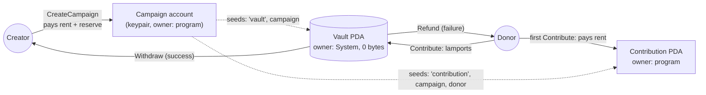
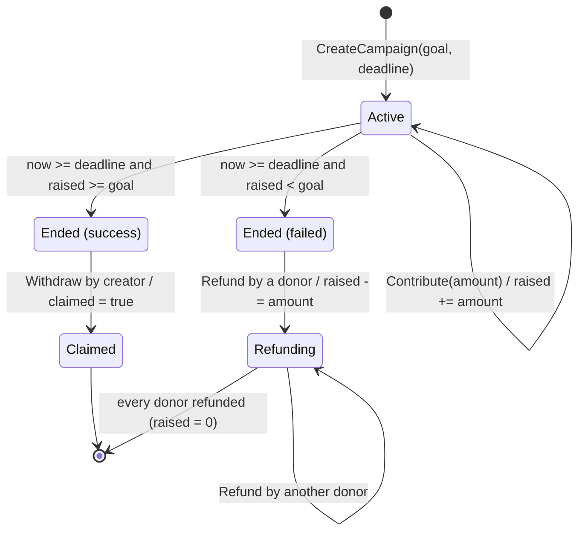
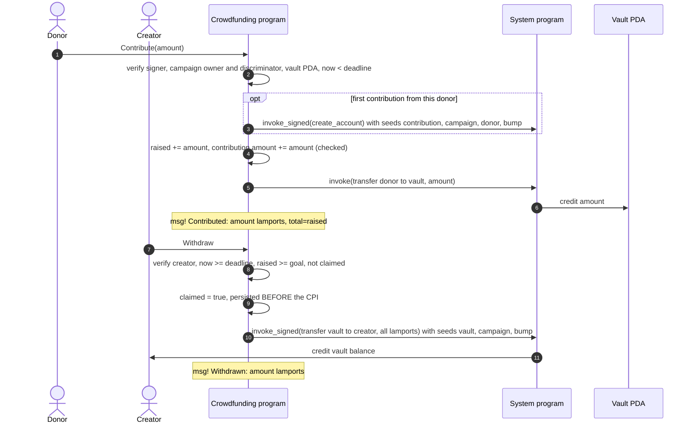
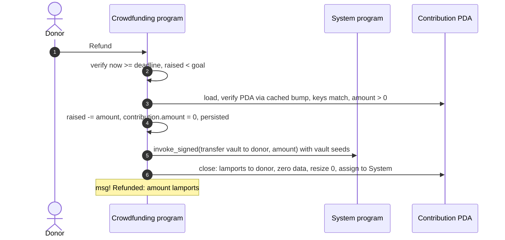

# Solana Crowdfunding

A **Kickstarter-style crowdfunding program for Solana**, written as a native Rust program
(`solana-program`, no Anchor). Creators open campaigns with a lamport goal and a deadline.
Donations are **escrowed in a program-derived vault**, not sent to the creator. After the
deadline the program allows exactly one outcome: the creator withdraws everything if the
goal was met, or every donor gets back exactly what they gave if it was not.

> **Network:** Solana **Devnet** · **Program ID:** see [Deployment](#deployment) ·
> **License:** [MIT](LICENSE)

---

## Table of contents

- [The problem](#the-problem)
- [Features](#features)
- [Quick start](#quick-start)
- [Architecture](#architecture)
  - [Accounts](#account-model)
  - [Instructions](#instructions)
  - [Campaign lifecycle](#campaign-lifecycle)
  - [Contribute / Withdraw / Refund flows](#instruction-flows)
  - [Design decisions](#design-decisions)
- [Error codes](#error-codes)
- [Security considerations](#security-considerations)
- [Project structure](#project-structure)
- [Prerequisites](#prerequisites)
- [Build](#build) · [Test](#test) · [Deploy to Devnet](#deploy-to-devnet) · [Run the demo](#run-the-demo)
- [Using the program from code](#using-the-program-from-code)
- [Brief testing checklist → tests](#brief-testing-checklist--tests)
- [Deployment](#deployment)
- [License](#license)

---

## The problem

Without a trusted intermediary, a creator who accepts donations directly can:

- take the money even if the project never reaches the amount it needs,
- not guarantee refunds when the goal is missed, and
- not prove to donors that funds stay locked until the conditions are met.

This program removes the intermediary. Funds sit in a **PDA vault that only the program can
sign for**, and the rules are enforced on-chain:

| Outcome after the deadline | Who can act | What happens |
|---|---|---|
| `raised >= goal` | the creator, once | `Withdraw` sends the **entire vault** to the creator and sets `claimed = true` |
| `raised < goal` | each donor | `Refund` returns **exactly that donor's contribution** and closes their record |

## Features

- **The four instructions from the brief**: `CreateCampaign(goal, deadline)`, `Contribute(amount)`,
  `Withdraw`, `Refund`, with the brief's log messages reproduced character for character.
- **PDA vault** `["vault", campaign]` that only the program can sign for (`invoke_signed`). The
  creator never holds donor funds before the goal is reached.
- **Per-donor accounting** through a `Contribution` PDA `["contribution", campaign, donor]`. Refunds
  return exact amounts, multiple contributions accumulate, and the record is closed on refund, so the
  donor also gets its rent back.
- **No double payouts**: `claimed` is set before the funds move, and refunded records are closed.
- **Hardened validation**: signer, writable, owner, PDA, System-program-id, account
  discriminator, duplicate-account and reinitialization checks, plus checked arithmetic
  everywhere. There is no `unwrap()` in program code; clippy enforces this.
- **Griefing-resistant account creation**: lamports sent to a not-yet-created PDA cannot block a
  donor's first contribution.
- **Rent reserve** in the vault, so contributions as small as 1 lamport work.
- **72 tests** (15 unit tests and 57 LiteSVM integration tests) that run against the compiled SBF
  binary, covering the brief's checklist, every error path and adversarial inputs.
- **TypeScript Devnet demo** (`scripts/`) that runs both outcomes and prints Explorer links,
  program logs and decoded campaign state.

## Quick start

```sh
export CARGO_BUILD_JOBS=2            # optional: limit parallelism on small machines
cargo build-sbf                      # -> target/deploy/solana_crowdfunding.so
cargo test                           # 72 tests against the compiled program

cd scripts && npm install && npm run typecheck
PROGRAM_ID=<deployed id> npm run demo   # Devnet by default
```

---

## Architecture



### Account model

| Account | Address / seeds | Owner | Data size | Rent-exempt minimum¹ | Paid by | Lifetime |
|---|---|---|---|---|---|---|
| **Campaign** | fresh keypair supplied by the client (signs `CreateCampaign`) | this program | `Campaign::LEN` = **58 B** (1 B discriminator + 57 B Borsh) | 1,294,560 lamports (≈0.0013 SOL) | creator | permanent |
| **Vault PDA** | `["vault", campaign]` | System program | **0 B** (lamports only) | 890,880 lamports (≈0.00089 SOL), the "rent reserve" | creator (reserve), donors (funds) | emptied by `Withdraw`; holds only the reserve after all refunds |
| **Contribution PDA** | `["contribution", campaign, contributor]` | this program | `Contribution::LEN` = **74 B** (1 B discriminator + 73 B Borsh) | 1,405,920 lamports (≈0.0014 SOL) | contributor (first contribution) | closed by `Refund` (rent goes back to the donor) |

¹ At the current rent rate (3,480 lamports per byte-year, 2-year exemption, plus a 128-byte account
overhead). The program always asks the `Rent` sysvar, so it never hard-codes these numbers.

**Byte layouts** (all integers little-endian, Borsh):

```text
Campaign (58 bytes)                          Contribution (74 bytes)
offset size field                            offset size field
0      1    account_type = 1                 0      1    account_type = 2
1      32   creator: Pubkey                  1      32   campaign: Pubkey
33     8    goal: u64                        33     32   contributor: Pubkey
41     8    raised: u64                      65     8    amount: u64
49     8    deadline: i64                    73     1    bump: u8
57     1    claimed: bool
```

`Campaign` is field-for-field the struct from the brief:

```rust
pub struct Campaign {
    pub creator: Pubkey,  // Who created this
    pub goal: u64,        // Target amount
    pub raised: u64,      // Current amount
    pub deadline: i64,    // When it ends
    pub claimed: bool,    // Already withdrawn?
}
```

The account-type discriminator is part of the account layout, not the struct. It is checked on
every load, together with the owner and the exact length (`AccountState::load` in
[`src/state.rs`](src/state.rs)).

### Instructions

Instruction data is the Borsh encoding of `CrowdfundingInstruction`: a 1-byte tag followed by
the arguments.

| Tag | Instruction | Args | Data size |
|---|---|---|---|
| `0` | `CreateCampaign` | `goal: u64`, `deadline: i64` | 17 B |
| `1` | `Contribute` | `amount: u64` | 9 B |
| `2` | `Withdraw` | none | 1 B |
| `3` | `Refund` | none | 1 B |

#### `CreateCampaign { goal, deadline }`

| # | Account | Signer | Writable | Notes |
|---|---|:-:|:-:|---|
| 0 | creator | ✅ | ✅ | pays for the campaign account and the vault reserve |
| 1 | campaign | ✅ | ✅ | fresh keypair; allocated here with owner = program |
| 2 | vault | | ✅ | `["vault", campaign]` |
| 3 | system_program | | | `11111111111111111111111111111111` |

- **Checks:** `goal > 0`; `deadline > Clock::unix_timestamp`; campaign not already initialized
  (System-owned and empty); creator ≠ campaign; vault PDA matches.
- **Effects:** creates the campaign account (rent-exempt, 58 B), stores
  `{creator, goal, raised: 0, deadline, claimed: false}`, and tops the vault up to
  `Rent::minimum_balance(0)`.
- **Log:** `Campaign created: goal={goal}, deadline={deadline}`
- **Errors:** `InvalidGoal`, `DeadlineInPast`, `AlreadyInitialized`, `DuplicateAccount`, `InvalidVault`.

#### `Contribute { amount }`

| # | Account | Signer | Writable | Notes |
|---|---|:-:|:-:|---|
| 0 | contributor | ✅ | ✅ | source of funds; pays for the contribution PDA on first use |
| 1 | campaign | | ✅ | owned by the program, discriminator `Campaign` |
| 2 | vault | | ✅ | `["vault", campaign]` |
| 3 | contribution | | ✅ | `["contribution", campaign, contributor]` |
| 4 | system_program | | | |

- **Checks:** `amount > 0`; `now < deadline`; vault PDA; contribution PDA (on-the-fly derivation
  if new, cached bump plus stored keys if it exists); `checked_add` on both counters.
- **Effects:** creates the contribution PDA on first contribution (`invoke_signed`),
  `campaign.raised += amount`, `contribution.amount += amount`, then `invoke(transfer donor → vault)`.
- **Log:** `Contributed: {amount} lamports, total={raised}`
- **Errors:** `ZeroAmount`, `CampaignEnded`, `InvalidVault`, `InvalidContributionAccount`,
  `InvalidAccountData`, `Overflow`.

#### `Withdraw`

| # | Account | Signer | Writable | Notes |
|---|---|:-:|:-:|---|
| 0 | creator | ✅ | ✅ | must equal `campaign.creator`; receives the funds |
| 1 | campaign | | ✅ | |
| 2 | vault | | ✅ | |
| 3 | system_program | | | |

- **Checks (all must hold):** caller is the creator; `now >= deadline`; `raised >= goal`; `!claimed`.
- **Effects:** `claimed = true` is **persisted first**, then
  `invoke_signed(transfer(vault → creator, vault.lamports()), seeds = ["vault", campaign, bump])`.
  "All SOL" means everything in the vault: contributions, the rent reserve, and any lamports
  sent to it directly.
- **Log:** `Withdrawn: {amount} lamports`
- **Errors:** `Unauthorized`, `InvalidVault`, `CampaignNotEnded`, `GoalNotReached`, `AlreadyClaimed`.

#### `Refund`

| # | Account | Signer | Writable | Notes |
|---|---|:-:|:-:|---|
| 0 | contributor | ✅ | ✅ | receives the refund and the record's rent |
| 1 | campaign | | ✅ | |
| 2 | vault | | ✅ | |
| 3 | contribution | | ✅ | the signer's own contribution PDA |
| 4 | system_program | | | |

- **Checks:** `now >= deadline`; `raised < goal`; the contribution PDA belongs to *this* campaign
  and *this* signer, is program-owned with the right discriminator, and has `amount > 0`.
- **Effects:** `campaign.raised -= amount` (`checked_sub`) and `contribution.amount = 0` are
  persisted, then `invoke_signed(transfer(vault → contributor, amount))`, then the contribution
  account is **closed** (lamports to the donor, data zeroed, resized to 0, assigned back to the
  System program).
- **Log:** `Refunded: {amount} lamports`
- **Errors:** `CampaignNotEnded`, `GoalReached`, `InvalidVault`, `InvalidContributionAccount`,
  `NothingToRefund`, `Overflow`.

Instructions also return generic runtime errors on malformed input: `MissingRequiredSignature`,
`IncorrectProgramId` (wrong owner or fake System program), `InvalidAccountData` (account not
writable), `NotEnoughAccountKeys`, and `InvalidInstructionData`.

### Campaign lifecycle

The status is derived from stored fields plus the clock (`Campaign::status`), so no extra
state is needed:



| Status | Contribute | Withdraw | Refund |
|---|:-:|:-:|:-:|
| Active (`now < deadline`) | ✅ | ❌ `CampaignNotEnded` | ❌ `CampaignNotEnded` |
| Ended (success) | ❌ `CampaignEnded` | ✅ once | ❌ `GoalReached` |
| Claimed | ❌ `CampaignEnded` | ❌ `AlreadyClaimed` | ❌ `GoalReached` |
| Ended (failed) / Refunding | ❌ `CampaignEnded` | ❌ `GoalNotReached` | ✅ once per donor |

### Instruction flows





### Design decisions

**Why a per-contributor `Contribution` PDA?** `Refund` has to return "the donor's
contribution", but `Campaign` (as specified) only stores the total `raised`. Without a per-donor
record the program could not know how much a donor gave, and anyone could ask for anything. The
PDA `["contribution", campaign, contributor]`:

- is unique per (campaign, donor) and derivable by any client, so no index or list is needed and
  there is no unbounded `Vec`;
- accumulates repeated contributions (`amount += …`) and costs its rent only once;
- is closed on refund. The donor recovers the ≈0.0014 SOL rent, and a second refund finds nothing
  (`NothingToRefund`);
- caches its `bump`, so later instructions verify it with one `create_program_address` instead of a
  bump search (`Contribute` costs ≈13k CU the first time and ≈7.7k CU afterwards).

**Why a rent reserve in the vault?** The vault is a 0-byte System account. The runtime rejects any
transaction that leaves an account with `0 < lamports < rent-exempt minimum`. Without a reserve, a
first contribution below ≈0.00089 SOL would fail, and a refund that leaves a small remainder could
fail too. `CreateCampaign` therefore has the creator pre-fund the vault with
`Rent::minimum_balance(0)`, skipped if the vault already holds that much. As a result:

- contributions of **any size** (even 1 lamport) succeed;
- `vault.lamports == reserve + raised (+ anything sent directly)` always holds;
- on success, `Withdraw` returns the reserve to the creator together with the funds, so the
  `Withdrawn: {amount}` log equals `raised + reserve + extras`;
- on failure, the reserve stays in the vault after all refunds (see
  [limitations](#limitations--future-work)).

**Why is the campaign a keypair account instead of a PDA?** The brief fixes the inputs of
`CreateCampaign` to exactly `goal` and `deadline`. A PDA would need extra seeds (for example a
creator-chosen id or a counter account) to let one creator run several campaigns. A fresh keypair
that co-signs the transaction gives every campaign a unique address with no extra arguments or
global state. It also proves the caller controls the address, so nobody can squat or pre-initialize
it. The program allocates it via CPI (`create_account`, payer = creator), so the client never has
to pre-allocate it with the right size and owner.

**Why is `claimed` set before the CPI?** This is checks-effects-interactions: the flag that
prevents a second payout is persisted before any lamports move. Solana does not allow re-entrancy
through the System program, but the ordering keeps the invariant robust to future changes, such as
adding a CPI to an untrusted program. If the transfer fails, the whole instruction (including the
flag) is rolled back atomically.

**Why decrement `raised` on refund?** It keeps `raised` equal to "lamports currently owed to
donors". Clients can read outstanding liabilities directly, and `raised == 0` means "everyone was
refunded". A failed campaign can never become successful through this, because the value only
decreases, and contributions are closed after the deadline. On a successful campaign, `raised` is
never touched after the deadline and stays as a historical record.

**Why validate with a shared `AccountState` trait?** `load` always performs the
owner → length → discriminator checks before Borsh decoding, and `store` always writes the
discriminator. A handler cannot read account data without those checks, which is how type
confusion and reinitialization are prevented without a framework.

**Lamports sent straight to the vault** do not count towards `raised`. The goal can only be reached
through tracked, refundable contributions. On success they are swept to the creator; on failure
they stay in the vault.

**Compute budget.** Every instruction stays far below the 200k CU default (measured in LiteSVM):

| Instruction | Compute units |
|---|---:|
| CreateCampaign | ~8,100 |
| Contribute (first, creates PDA) | ~13,100 |
| Contribute (subsequent) | ~7,700 |
| Withdraw | ~5,500 |
| Refund | ~7,700 |

The vault bump is re-derived with `find_program_address` (the pattern from the brief) instead of
being stored, so `Campaign` stays exactly as specified.

---

## Error codes

Custom errors are returned as `ProgramError::Custom(code)`, which shows up in clients as
`custom program error: 0x…`. The codes are stable; new variants are only ever appended.
`scripts/lib/program.ts` maps the codes back to names.

| Code | Hex | Name | When |
|---:|---|---|---|
| 0 | `0x0` | `InvalidGoal` | `CreateCampaign` with `goal == 0` |
| 1 | `0x1` | `DeadlineInPast` | `deadline <= now` at creation |
| 2 | `0x2` | `CampaignEnded` | `Contribute` at or after the deadline |
| 3 | `0x3` | `CampaignNotEnded` | `Withdraw` / `Refund` before the deadline |
| 4 | `0x4` | `GoalNotReached` | `Withdraw` with `raised < goal` |
| 5 | `0x5` | `GoalReached` | `Refund` with `raised >= goal` |
| 6 | `0x6` | `AlreadyClaimed` | second `Withdraw` |
| 7 | `0x7` | `Unauthorized` | `Withdraw` signer is not `campaign.creator` |
| 8 | `0x8` | `InvalidVault` | vault is not `["vault", campaign]` or not System-owned |
| 9 | `0x9` | `InvalidContributionAccount` | contribution account is not `["contribution", campaign, signer]` or its stored keys mismatch |
| 10 | `0xa` | `NothingToRefund` | the signer has no (remaining) contribution |
| 11 | `0xb` | `ZeroAmount` | `Contribute` with `amount == 0` |
| 12 | `0xc` | `Overflow` | checked arithmetic overflow or underflow |
| 13 | `0xd` | `AlreadyInitialized` | `CreateCampaign` on an account that is already in use |
| 14 | `0xe` | `InvalidAccountData` | wrong size, wrong discriminator (type confusion), or undecodable data |
| 15 | `0xf` | `DuplicateAccount` | the same account is passed for creator and campaign |

---

## Security considerations

| Threat | Mitigation | Test(s) |
|---|---|---|
| Missing authorization | `assert_signer` on creator, campaign keypair and contributor. `Withdraw` also requires `signer == campaign.creator` | `*_requires_*_signature`, `withdraw::fails_for_non_creator` |
| Forged campaign account | `AccountState::load` requires owner == program id, exact length and the `Campaign` discriminator | `security::rejects_campaign_not_owned_by_program`, `…system_owned_campaign…` |
| Type confusion | 1-byte account discriminator (`AccountType`); `0` is never valid, so zeroed accounts are rejected | `security::rejects_contribution_account_passed_as_campaign`, `state::tests::*` |
| Wrong or attacker-chosen vault | the vault is re-derived from the campaign key on every instruction and must be System-owned | `security::*_wrong_vault*`, `…vault_of_another_campaign` |
| Wrong contribution record | PDA re-derived (or re-created from its cached bump), and the stored `campaign`/`contributor` must match | `security::*contribution*`, `refund::cannot_claim_someone_elses_contribution` |
| Fake System program | `assert_system_program` before any CPI | `security::rejects_fake_system_program` |
| Reinitialization | `CreateCampaign` requires a System-owned, empty campaign account that signs. Contribution PDAs are only created when not already program-owned | `create_campaign::rejects_reinitializing_existing_campaign`, `…by_another_creator` |
| Double withdraw | `claimed` checked and persisted before the transfer | `withdraw::fails_when_already_claimed` |
| Double refund / closed-account revival | record zeroed before the CPI. The account is then closed: lamports drained, data wiped, resized to 0, assigned to System | `refund::fails_on_double_refund`, `refund::closes_contribution_account_completely` |
| Integer overflow | `checked_add` / `checked_sub` → `Overflow`. `overflow-checks = true` in release | `contribute::rejects_when_raised_would_overflow` |
| Duplicate mutable accounts | creator ≠ campaign is enforced. Other aliases are impossible by construction (PDAs cannot sign, the campaign is program-owned and cannot fund a transfer) | `create_campaign::rejects_creator_as_campaign_account` |
| PDA pre-funding DoS | `create_program_account` uses transfer + allocate + assign when the address already holds lamports | `security::prefunded_contribution_pda_cannot_block_donor`, `create_campaign::succeeds_when_*_prefunded` |
| Rent-exemption failures | vault rent reserve. All new accounts are funded from `Rent::get()` | `contribute::accepts_single_lamport_thanks_to_rent_reserve` |
| Panics | no `unwrap`/`expect`/`panic` in program code (`#![deny(clippy::unwrap_used, …)]`). All errors are typed | clippy |

**Clock usage.** Deadlines are compared against `Clock::get()?.unix_timestamp`, the
stake-weighted validator time estimate. It can drift from wall-clock time by a few seconds, which
is irrelevant for day-scale campaigns. The boundaries are explicit: contributions are allowed
while `now < deadline`, and withdraw/refund while `now >= deadline`, so the two never overlap.
The demo waits on *cluster* time (`getBlockTime`), not the local clock, for the same reason.

### Limitations & future work

- **No cancellation or editing.** A creator cannot cancel, extend or change the goal of a
  campaign. This is by design, since donors rely on the original terms. A `Cancel` instruction
  that turns the campaign into a refundable failure would be a natural extension.
- **Self-funding is possible.** Like any all-or-nothing scheme, a creator (or anyone) can
  contribute the shortfall right before the deadline to force success. Donors should treat the
  goal as a signal, not a guarantee of independent demand.
- **Leftover rent after a failed campaign.** The vault's rent reserve (≈0.00089 SOL), any lamports
  sent to the vault directly, and the campaign account's rent (≈0.0013 SOL) are not reclaimed.
  Future work: a creator-only `CloseCampaign` that, once the campaign is claimed or fully refunded
  (`raised == 0`), sweeps the vault and closes the campaign account.
- **Contribution records of successful campaigns stay open.** Only `Refund` closes them, so after a
  successful campaign each donor's ≈0.0014 SOL record rent remains locked. Future work: a
  `CloseContribution` instruction that donors can call once the campaign is `Claimed`.
- **Pull-based refunds.** Each donor must call `Refund` themselves. A permissionless "crank" that
  refunds donors in batches is possible because contribution PDAs are derivable.
- **Native SOL only.** SPL-token campaigns would need token-account vaults owned by the vault PDA.
- **Upgrade authority.** As with any upgradeable program, whoever holds the upgrade authority can
  change the code. For production, transfer it to a multisig or make the program immutable
  (`solana program set-upgrade-authority --final`).

---

## Project structure

```text
solana-crowdfunding/
├── Cargo.toml                  # crate `solana-crowdfunding`, lib `solana_crowdfunding` (cdylib + lib)
├── Cargo.lock                  # pinned versions (commit it)
├── src/
│   ├── lib.rs                  # module wiring, declare_id!, crate docs
│   ├── entrypoint.rs           # BPF entrypoint (disabled by feature `no-entrypoint`)
│   ├── instruction.rs          # CrowdfundingInstruction (Borsh) + client builders
│   ├── state.rs                # Campaign, Contribution, AccountType, AccountState trait
│   ├── pda.rs                  # VAULT_SEED, CONTRIBUTION_SEED, derivation helpers
│   ├── validation.rs           # assert_signer / writable / owned_by / system_program / vault / pda
│   ├── error.rs                # CrowdfundingError -> ProgramError::Custom
│   └── processor/
│       ├── mod.rs              # dispatch, clock helper, contribution loader
│       ├── cpi.rs              # create_program_account, transfers, invoke_signed vault transfer, close
│       ├── create_campaign.rs
│       ├── contribute.rs
│       ├── withdraw.rs
│       └── refund.rs
├── tests/integration/          # one LiteSVM test binary running target/deploy/*.so
│   ├── main.rs
│   ├── common/mod.rs           # TestContext harness (clock warp, helpers, assertions)
│   ├── checklist.rs            # the brief's Testing Checklist, end to end
│   ├── create_campaign.rs
│   ├── contribute.rs
│   ├── withdraw.rs
│   ├── refund.rs
│   └── security.rs             # forged accounts, wrong PDAs, signers, griefing
├── scripts/                    # TypeScript Devnet demo client
│   ├── package.json            # npm run demo / npm run typecheck
│   ├── tsconfig.json
│   ├── demo.ts                 # success path + refund path
│   └── lib/
│       ├── program.ts          # PDA seeds, instruction encoding, account decoding, error names
│       ├── config.ts           # PROGRAM_ID / RPC_URL / KEYPAIR resolution, Explorer links
│       └── cluster.ts          # send + logs, cluster-time polling, state printing
├── .env.example
├── .gitignore
├── LICENSE
└── README.md
```

---

## Prerequisites

| Tool | Version tested | Install |
|---|---|---|
| Rust (host) | 1.99 stable (MSRV of the dependencies: 1.89) | [rustup.rs](https://rustup.rs) (`rustup component add rustfmt clippy`) |
| Agave / Solana CLI | 4.3.0 | `sh -c "$(curl -sSfL https://release.anza.xyz/v4.3.0/install)"` |
| `cargo-build-sbf` | 4.4.0 (platform-tools v1.57, rustc 1.95), installed with the CLI | |
| Node.js | 20.x (npm 10) | [nodejs.org](https://nodejs.org) |

**Rust dependencies** (see `Cargo.toml`): `solana-program 4.1`, `solana-system-interface 3.3`
(`bincode` feature, System instruction builders), `solana-sysvar 4.2` (`Clock::get` /
`Rent::get`), `borsh 1.5`, `thiserror 2`. Dev-dependencies: `litesvm 0.17` plus the matching
`solana-keypair` / `solana-signer` / `solana-transaction` / `solana-account` crates.

> `solana-program 4.1` (not 5.x) is used on purpose: it shares `solana-instruction 3.5` /
> `solana-address 2.7` with `litesvm 0.17`, so the program's `Instruction` and `Pubkey` types work
> directly in the tests. `Cargo.lock` pins `solana-pubkey 4.3.0` for the same reason.

**TypeScript dependencies** (`scripts/package.json`): `@solana/web3.js ^1.98`, plus dev-only
`typescript ~5.9`, `tsx ^4.20`, `@types/node ^20`. Instructions are encoded by hand with `Buffer`,
so there is no Borsh dependency.

## Build

```sh
cargo build-sbf
# -> target/deploy/solana_crowdfunding.so          (~96 KiB)
# -> target/deploy/solana_crowdfunding-keypair.json (program address keypair, git-ignored)
```

On memory-constrained machines, limit parallelism with `export CARGO_BUILD_JOBS=2` (and
`cargo build-sbf --jobs 2`).

## Test

The integration tests load the **compiled** program from `target/deploy/solana_crowdfunding.so`
into [LiteSVM](https://github.com/LiteSVM/litesvm), so build it first:

```sh
cargo build-sbf && cargo test
```

```text
running 15 tests   (unit: state layouts & LEN constants, wire format, PDAs, errors)
test result: ok. 15 passed; 0 failed

running 57 tests   (integration: checklist, create, contribute, withdraw, refund, security)
test result: ok. 57 passed; 0 failed
```

Time-dependent behaviour is tested by overwriting LiteSVM's `Clock` sysvar
(`TestContext::warp_to`). Set `SBF_OUT_DIR` to load the `.so` from somewhere else. Lint with
`cargo fmt --check && cargo clippy --all-targets -- -D warnings`.

## Deploy to Devnet

> Every command below targets **Devnet**. Any Devnet RPC endpoint works: pass `--url <rpc>` to an
> individual command, or set it once with `solana config set --url <rpc>`. The default used
> throughout is `https://api.devnet.solana.com`.

1. **Point the CLI at Devnet and fund a wallet.**

   ```sh
   solana config set --url https://api.devnet.solana.com
   solana-keygen new                # only if you have no wallet yet; keep the file private
   solana airdrop 2                 # rate-limited; if it fails use https://faucet.solana.com
   solana balance
   ```

   The public faucet limits requests per wallet/IP. [faucet.solana.com](https://faucet.solana.com)
   (GitHub login) gives larger, more reliable amounts.

2. **Set the program ID in the source.** `cargo build-sbf` generated a program keypair whose
   public key will be the program address:

   ```sh
   solana address -k target/deploy/solana_crowdfunding-keypair.json
   ```

   In this repository `src/lib.rs` already declares `8161wQkF9HFd9idyE4AzNQFkWQk2KqxZwiswxviYL9g5`,
   the address of the program keypair used for the reference Devnet deployment. If you deploy your
   own copy (with your own program keypair), replace it with your address and rebuild:

   ```rust
   solana_program::declare_id!("<YOUR_PROGRAM_ID>");
   ```

   ```sh
   cargo build-sbf && cargo test
   ```

   The on-chain logic always uses the runtime `program_id`. `declare_id!` makes
   `solana_crowdfunding::id()` (used by Rust clients) match the deployment.

3. **Deploy.**

   ```sh
   solana program deploy target/deploy/solana_crowdfunding.so \
     --program-id target/deploy/solana_crowdfunding-keypair.json
   solana program show <YOUR_PROGRAM_ID>
   ```

   **Cost estimate:** the ~96 KiB program needs ≈**0.68 SOL** of rent for its program-data
   account at the standard rent rate (≈0.50 SOL on Devnet at the time of the reference
   deployment), plus a temporary buffer of the same size during upload (refunded when the deploy
   completes) and the transaction fees. Have about **1.5 SOL** available.

   **Rate-limited RPCs:** public endpoints often throttle the ~100 buffer-write transactions.
   Add `--use-rpc` to send them through the RPC, and if the upload is still interrupted, resume it
   instead of starting over: recover the buffer keypair from the 12-word phrase the CLI prints
   (`solana-keygen recover -o buffer.json`), then rerun the deploy with `--buffer buffer.json`
   (only the missing chunks are rewritten). To abandon it instead, reclaim the SOL with
   `solana program close <BUFFER_ADDRESS>` (or `solana program close --buffers`).

4. **Keep `target/deploy/solana_crowdfunding-keypair.json` safe** (outside the repo; it is
   git-ignored). It is the program's address key. Upgrades are authorized by your wallet (the
   upgrade authority): rebuild and rerun the same `solana program deploy` command.

## Run the demo

`scripts/demo.ts` runs both outcomes against the deployed program, with your wallet acting as both
creator and donor:

- **Campaign A (success):** create (goal 0.01 SOL, deadline in 20 s), contribute 0.01 SOL, wait
  until *cluster* time passes the deadline, withdraw.
- **Campaign B (refund):** create (goal 0.05 SOL), contribute 0.005 SOL, wait, refund.

```sh
cd scripts
npm install
PROGRAM_ID=<YOUR_PROGRAM_ID> npm run demo
# or: npm run demo -- <YOUR_PROGRAM_ID>
```

| Variable | Default | Purpose |
|---|---|---|
| `PROGRAM_ID` (or first CLI argument) | required | deployed program address |
| `RPC_URL` | `https://api.devnet.solana.com` | any Devnet RPC endpoint |
| `KEYPAIR` | `keypair_path` from `~/.config/solana/cli/config.yml`, else `~/.config/solana/id.json` | payer/creator/donor wallet (read locally at runtime, never printed) |
| `DEADLINE_SECONDS` | `20` | campaign duration |
| `EXPLORER_CLUSTER` | derived from `RPC_URL` (`devnet`, `testnet`, or a custom URL) | forces the Explorer `?cluster=` parameter |

The demo needs ≈0.03 SOL. Most of it comes back: Campaign A's funds and reserve are withdrawn,
and Campaign B's contribution and record rent are refunded. The net cost is roughly two campaign
accounts, Campaign A's contribution record, Campaign B's vault reserve and fees (≈0.005 SOL).

Example output (abridged; addresses and signatures will differ):

```text
Solana Crowdfunding demo
  rpc:     https://api.devnet.solana.com/
  program: <PROGRAM_ID>
  payer:   <WALLET> (2.000000000 SOL)

━━ Campaign A: goal reached → creator withdraws ━━
    campaign:  7xQe…  https://explorer.solana.com/address/7xQe…?cluster=devnet
    vault:     4Bd9…
  ✔ CreateCampaign(goal=0.010000000 SOL, deadline=1791460000)
    signature: 5h3K…
    explorer:  https://explorer.solana.com/tx/5h3K…?cluster=devnet
    log:       Campaign created: goal=10000000, deadline=1791460000
    state: { goal: '0.010000000 SOL', raised: '0.000000000 SOL', claimed: false, status: 'Active', vaultBalance: '0.000890880 SOL', … }
  ✔ Contribute(0.010000000 SOL)
    log:       Contributed: 10000000 lamports, total=10000000
  … waiting for cluster time to pass deadline 1791460000 (14s) (9s) (4s) ✔
  ✔ Withdraw
    log:       Withdrawn: 10890880 lamports
    state: { raised: '0.010000000 SOL', claimed: true, status: 'Claimed', vaultBalance: '0.000000000 SOL', … }

━━ Campaign B: goal missed → donor refunds ━━
  ✔ CreateCampaign(goal=0.050000000 SOL, deadline=1791460041)
  ✔ Contribute(0.005000000 SOL)
    log:       Contributed: 5000000 lamports, total=5000000
  ✔ Refund
    log:       Refunded: 5000000 lamports
    state: { raised: '0.000000000 SOL', status: 'Failed', vaultBalance: '0.000890880 SOL', … }

━━ Summary (paste into the README's Deployment section) ━━
| Step | Signature | Explorer |
…
```

If a transaction fails, the demo prints the program logs and decodes the custom error, for
example `✘ Withdraw failed: CrowdfundingError::CampaignNotEnded`.

## Using the program from code

**Rust** (another program, a CLI, or a backend). Depend on the crate with the `no-entrypoint`
feature and use the builders, PDA helpers and state decoders:

```toml
solana-crowdfunding = { git = "https://github.com/faizath/solana-crowdfunding", features = ["no-entrypoint"] }
```

```rust
use solana_crowdfunding::{instruction, pda, state::{AccountState, Campaign}};

let program_id = solana_crowdfunding::id();
let ix = instruction::contribute(&program_id, &donor, &campaign, 50_000_000);
let (vault, _bump) = pda::find_vault_address(&program_id, &campaign);
let state = Campaign::unpack(&campaign_account.data)?; // checks size + discriminator
```

**TypeScript.** `scripts/lib/program.ts` exports `createCampaignIx`, `contributeIx`,
`withdrawIx`, `refundIx`, `findVaultAddress`, `findContributionAddress`, `decodeCampaign`,
`campaignStatus` and `programErrorName`. A golden-vector unit test
(`pda::tests::vault_address_golden_vector`) keeps the Rust and TypeScript PDA derivations in sync.

This is a native program, so there is no Anchor IDL. The [instruction tables](#instructions),
[byte layouts](#account-model) and [error codes](#error-codes) above are the complete interface,
and `scripts/lib/program.ts` is a reference implementation of it.

---

## Brief testing checklist → tests

All tests live in `tests/integration/`. The checklist is run as one end-to-end scenario
(goal = 1000 SOL, deadline = now + 1 day) and each step also has focused tests.

| Brief checklist step | Expected | Test(s) |
|---|---|---|
| Create a campaign with goal = 1000 SOL, deadline = tomorrow | success, state stored, exact log | `checklist::brief_testing_checklist_end_to_end` (step 1), `create_campaign::stores_initial_state_and_funds_rent_reserve`, `create_campaign::logs_exact_message` |
| Contribute 600 SOL | success, `raised = 600` | `checklist::…` (step 2), `contribute::moves_lamports_into_vault_and_records_contribution` |
| Contribute 500 SOL | success, `raised = 1100` | `checklist::…` (step 3), `contribute::accepts_contributions_beyond_goal`, `contribute::same_donor_contributions_accumulate` |
| Try withdraw before deadline | fails (`CampaignNotEnded`) | `checklist::…` (step 4), `withdraw::fails_before_deadline` |
| Wait until after deadline → withdraw | success, creator receives the vault | `checklist::…` (step 5), `withdraw::pays_entire_vault_to_creator_when_goal_exactly_met_at_deadline` |
| Try withdraw again | fails (`AlreadyClaimed`) | `checklist::…` (step 6), `withdraw::fails_when_already_claimed` |

| Brief success criterion | Test(s) |
|---|---|
| Accept campaign creation with goal and deadline | `create_campaign::*` (including `rejects_zero_goal`, `rejects_deadline_in_past`, `rejects_deadline_equal_to_now`) |
| Accept contributions and track total raised | `contribute::*` (including `rejects_zero_amount`, `rejects_at_deadline`, `rejects_after_deadline`, `tracks_each_donor_separately`) |
| Withdrawal only if goal reached after deadline | `withdraw::fails_before_deadline`, `fails_when_goal_not_met`, `fails_when_nothing_was_raised`, `fails_for_non_creator` |
| Refunds only if goal not reached after deadline | `refund::returns_each_contributor_exactly_their_contribution`, `fails_before_deadline`, `fails_when_goal_met`, `fails_for_non_contributor` |
| Prevent double withdrawals | `withdraw::fails_when_already_claimed` (even after the vault is refilled); `refund::fails_on_double_refund` |
| Use a PDA vault (not direct transfers) | `create_campaign::stores_initial_state_and_funds_rent_reserve`, `security::*_vault*`, `contribute::direct_vault_transfers_do_not_count_towards_goal` |
| Exact log messages | every success test asserts its `Program log:` line with `assert_logged` |

---

## Deployment

Deployed to **Solana Devnet** on 2026-10-08 and exercised with `scripts/demo.ts`.

| | |
|---|---|
| **Network** | Solana Devnet |
| **Program ID** | `8161wQkF9HFd9idyE4AzNQFkWQk2KqxZwiswxviYL9g5` |
| **Explorer** | https://explorer.solana.com/address/8161wQkF9HFd9idyE4AzNQFkWQk2KqxZwiswxviYL9g5?cluster=devnet |
| **Deploy tx signature** | `Wo968DEV9Pgod3CA43g2D6GMSF1tCcz6C1DurxHPUWp22s6bpDuAZ2JfETkhcsJ8o4ZzSPjhYV6AfyeZu4Xfezx` ([view](https://explorer.solana.com/tx/Wo968DEV9Pgod3CA43g2D6GMSF1tCcz6C1DurxHPUWp22s6bpDuAZ2JfETkhcsJ8o4ZzSPjhYV6AfyeZu4Xfezx?cluster=devnet)) |
| **Upgrade authority** | `KFg9A4iJC6VLd81R1T25sYucgdTV44ZajFmKFSfAVBp` |
| **Program size** | 97,968 bytes |

**Demo transaction signatures** (all `Status: Ok`)

Campaign A [`5zDW4u6KQLejwmsRLAGbp3EFoA9ZQdPC8VSD3qzv4bcC`](https://explorer.solana.com/address/5zDW4u6KQLejwmsRLAGbp3EFoA9ZQdPC8VSD3qzv4bcC?cluster=devnet) (goal 0.01 SOL, reached → withdrawn) and
Campaign B [`ARvcQH1CJT4ScbWbJqnCJDD2irvnH8hXCng7JF97Zq2c`](https://explorer.solana.com/address/ARvcQH1CJT4ScbWbJqnCJDD2irvnH8hXCng7JF97Zq2c?cluster=devnet) (goal 0.05 SOL, missed → refunded).

| Step | Signature | Program log | Explorer |
|---|---|---|---|
| Create campaign A | `556xcUSMmnAbN67CUTzPStrFr8b1kwxXsK62bETZDDe6MaLZxHEMn1nAuJASBUohGH4bxPHdVjj9D5KaZTvpTcLg` | `Campaign created: goal=10000000, deadline=1791460308` | [view](https://explorer.solana.com/tx/556xcUSMmnAbN67CUTzPStrFr8b1kwxXsK62bETZDDe6MaLZxHEMn1nAuJASBUohGH4bxPHdVjj9D5KaZTvpTcLg?cluster=devnet) |
| Contribute (A) | `vATbkd38KTpKiWU3aBDPK2MfNCfPWkcfjGYVUKi6ZzGjvyHLip6V21pPhR4RWg21eLyPX3NEQzn6XkkMUFsacZT` | `Contributed: 10000000 lamports, total=10000000` | [view](https://explorer.solana.com/tx/vATbkd38KTpKiWU3aBDPK2MfNCfPWkcfjGYVUKi6ZzGjvyHLip6V21pPhR4RWg21eLyPX3NEQzn6XkkMUFsacZT?cluster=devnet) |
| Withdraw (A) | `1qPXAb89BFXt837VD6SeMc57bZyu4A5oVKPtU2bfZvJWa3BKFn7d1tU9rbKfGTFpayPEsndxTF2UcLGuyPk5ihk` | `Withdrawn: 10650240 lamports` | [view](https://explorer.solana.com/tx/1qPXAb89BFXt837VD6SeMc57bZyu4A5oVKPtU2bfZvJWa3BKFn7d1tU9rbKfGTFpayPEsndxTF2UcLGuyPk5ihk?cluster=devnet) |
| Create campaign B | `3R5mwvaFCpcns13SjDescvhZ4sP4F6RBVxFCufKGNtd7Xv3sU7jxSFnp2QsKv6br8FzNAouuRtjhDPkaJetoHh2k` | `Campaign created: goal=50000000, deadline=1791460341` | [view](https://explorer.solana.com/tx/3R5mwvaFCpcns13SjDescvhZ4sP4F6RBVxFCufKGNtd7Xv3sU7jxSFnp2QsKv6br8FzNAouuRtjhDPkaJetoHh2k?cluster=devnet) |
| Contribute (B) | `4DT7dUDaeWXEYcxYd6QU7tXmrbh1rcUeRUY74muo8XnG9cJJ7iyUWt7ipXdNunfDHNRtfYoPPpYtjvVtiYnVPcj1` | `Contributed: 5000000 lamports, total=5000000` | [view](https://explorer.solana.com/tx/4DT7dUDaeWXEYcxYd6QU7tXmrbh1rcUeRUY74muo8XnG9cJJ7iyUWt7ipXdNunfDHNRtfYoPPpYtjvVtiYnVPcj1?cluster=devnet) |
| Refund (B) | `2PEF2u5cBfhzk22ZxYTxiUU21j3hhq6oYaGF7A7bEMrNbkbSAzNnWcsM4w2m2XFe9sr2RuzvbyWuqGaSXwv1Bz4c` | `Refunded: 5000000 lamports` | [view](https://explorer.solana.com/tx/2PEF2u5cBfhzk22ZxYTxiUU21j3hhq6oYaGF7A7bEMrNbkbSAzNnWcsM4w2m2XFe9sr2RuzvbyWuqGaSXwv1Bz4c?cluster=devnet) |

The withdrawn amount is the 0.01 SOL raised plus the vault's rent reserve (650,240 lamports at Devnet's
current rent rate). After the refund, Campaign B's vault holds only that reserve.

## License

[MIT](LICENSE) © 2026 Faiz A
